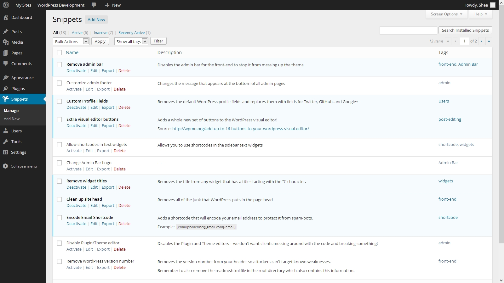
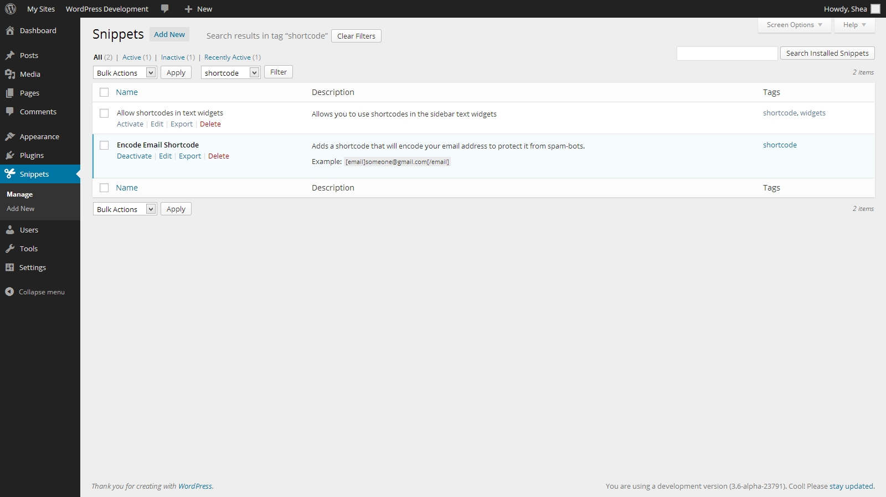
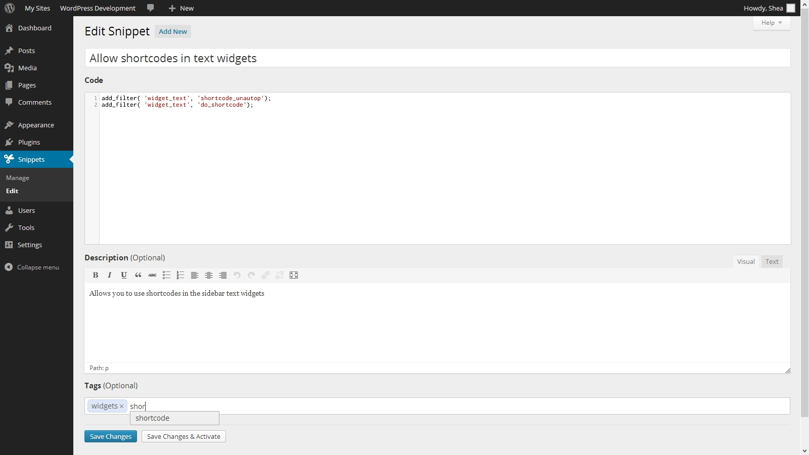

# Code Snippets Tags

* __Requires at least:__ [Code Snippets 1.8][code-snippets-github] and [WordPress 3.3](http://wordpress.org/download/)
* __Tested up to:__ [WordPress 4.0](http://wordpress.org/download/)
* __Stable version:__ [1.2.1](http://downloads.wordpress.org/plugin/code-snippets-tags.latest-stable.zip)
* __License:__ [MIT](http://opensource.org/licenses/MIT)

> In Code Snippets version 2.0 or later, tags functionality is built in and this plugin is redundant

Organize your code snippets with tags. Adds support to the Code Snippets WordPress plugin for adding tags to snippets.

## Description

Adds support to the Code Snippets WordPress plugin for adding tags to snippets. Requires [Code Snippets][code-snippets-github] 1.8 or later.

You can assign tags to snippets using an interactive UI when editing or adding a new snippet. Then, you can filter snippets by tag on the snippets table, or see what tags are assigned to a particular snippet with a glance at the new table column. Tags are stored in your database and can be exported and imported along with the other snippet data.

Visit the [plugin homepage](http://code-snippets.bungeshea.com/plugins/tags/) or download and review it on [WordPress.org](http://wordpress.org/plugins/code-snippets-tags)).

## Installation

1. Install [Code Snippets][code-snippets-github] using the [directions](https://github.com/bungeshea/code-snippets#installation) provided with the plugin
1. [Download the plugin](https://github.com/bungeshea/code-snippets-tags/archive/master.zip)
1. Extract the contents of the zip file
1. Rename the resulting folder to `code-snippets-tags`
1. Upload this folder to the `wp-content/plugins/` folder of your WordPress installation
1. Activate the "Code Snippets Tags" plugin from 'Plugins' page.

## Screenshots

### The tags column in the snippets table

### Filtering snippets based on tag

### Editing a snippet's tags

  [code-snippets-github]: https://github.com/bungeshea/code-snippets
